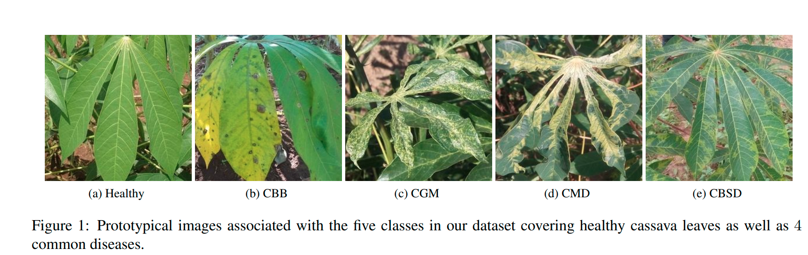

**cassava_disease_classification**

Classify pictures of cassava leaves into 1 of 4 disease categories (or healthy)



### Dataset Paper:
```
Viral diseases are major sources of poor yields for cassava, the 2nd largest provider of carbohydrates in Africa.
At least 80% of small-holder farmer households in SubSaharan Africa grow cassava. Since many of these farmers
have smart phones, they can easily obtain photos of diseased and healthy cassava leaves in their farms, allowing
the opportunity to use computer vision techniques to monitor the disease type and severity and increase yields. However, annotating these images is extremely difficult as experts who are able to distinguish between highly similar diseases need to be employed. We provide a dataset of labeled
and unlabeled cassava leaves and formulate a Kaggle challenge to encourage participants to improve the performance
of their algorithms using semi-supervised approaches. This
paper describes our dataset and challenge which is part of
the Fine-Grained Visual Categorization workshop at CVPR
2019. 
```
[iCassava 2019 Fine-Grained Visual Categorization Challenge](https://arxiv.org/pdf/1908.02900.pdf)

## Libraries
----------------------

- [Pytorch](https://pytorch.org/)
- [FastAI](https://www.fast.ai/)

## Approches

- Fine-tuning  pre-trained  models: [notebook](https://github.com/IsraelAbebe/cassava_disease_classification/blob/master/Finetuning.ipynb)
- Hyperparameter search on Fine-tuning  pre-trained  models: [notebook](https://github.com/IsraelAbebe/cassava_disease_classification/blob/master/Hyperparameter_search_pytorch.ipynb)
